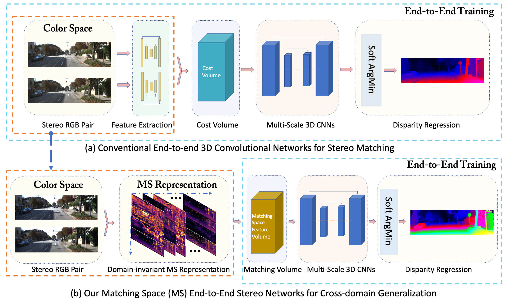

# MS-Nets (Code Coming Soon!!!)
Domain-invariant Matching Space Stereo Networks (MS-Nets)

## Introduction

## Building Requirements

## How to Use?

## Pretrained Models

## Results

## Reference:

If you find the code useful, please cite our paper:

    @inproceedings{Cai2020MS-Nets,
      title={Matching-space Stereo Networks for Cross-domain Generalization},
      author={Cai, Changjiang and Matteo, Poggi and Stefano , Mattoccia and Mordohai, Philippos},
      booktitle={International Conference on 3D Vision (3DV)},
      year={2020}
    }
