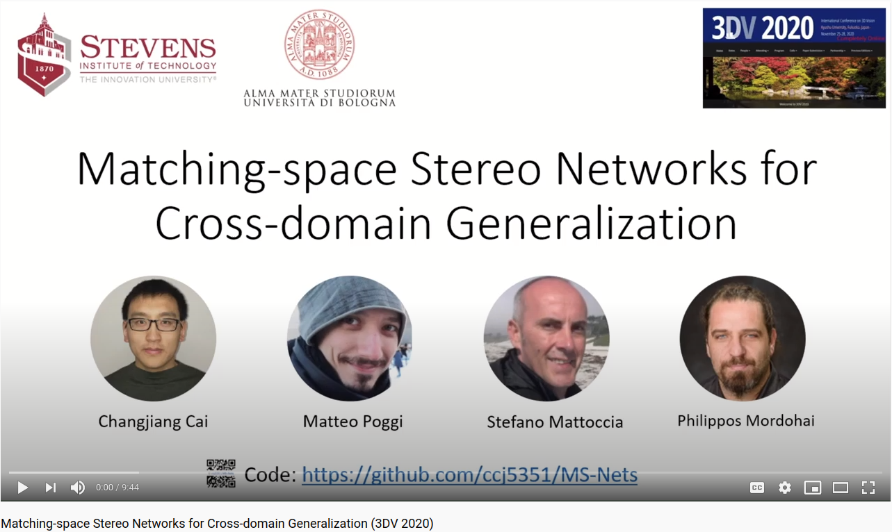

# Matching-space Stereo Networks for Cross-domain Generalization (MS-Net)

This is a work by [Changjiang Cai](https://www.changjiangcai.com), [Matteo Poggi](https://mattpoggi.github.io/), [Stefano Mattoccia](http://vision.deis.unibo.it/~smatt/Site/Home.html), [Philippos Mordohai](https://mordohai.github.io/) - 3DV 2020


See the links: [**arXiv**](https://arxiv.org/abs/2010.07347), [**Slides**](https://github.com/ccj5351/MS-Nets/blob/master/files/msnet-10mins-final.pdf), [**Poster**](https://github.com/ccj5351/MS-Nets/blob/master/files/poster-msnet.pdf), [**Conf-Proceeding**](https://www.changjiangcai.com/files/dafstereonet-3dv2020/daf-stereo-3dv-conf20-pub.pdf)

<p align="center">
 
</p>

---

Please check our presentation video as shown below:

<p align="center">
  <a href="https://youtu.be/j2QFDix0_fM">
  
  </a>
</p>

---


The repository contains the code, models and instructions for training and testing. 

## Introduction

We propose our matching space stereo networks - **MSNet**, with improved generalization properties. First, we replace learning-based feature extraction from RGB with Matching functions and confidence measures from conventional wisdom. This way, we move the learning process from color space to Matching Space, avoiding over-specialization to domain specific features. Specifically, we modify GCNet and PSMNet architectures to accept Matching Space inputs. PSMNet allocates most of the parameters to unary feature extraction, while GCNet does this to 3D convolutions, resulting in different behaviors of domain generalization.

## Dependencies

The following shows our setup succefully run in our experiments (N.B. older or later versions might work, but we do not test).  

```
gcc: 7.5.0
GPU: Titan XP (12GB) or Titan RTX (24GB) 
pytorch: >=1.2.0
cuda: >=10.0
OpenCV: opencv-3.2.0
Boost: 1.72.0 (for Boost Python)
Other commonly used Python Lib: e.g., Numpy, Matplotlib, Cython etc (Check the code for details)
Verified platform/settings: ubuntu 16.04 (or 18.04) + cuda 10.0 + python 3.7 (or 3.5)
```

## Run MSNet for Experiments

Assuming this repository is located at `~/MS-Nets` (definitely you can put it anywhere you prefer), with Ubuntu 18.04 OS and Python 3.7.

1. Compile the code to generate the libraries (with the help of Boost-Python) which are used to extract Matching Space (MS) features, as follows:

   ```bash
   cd ~/MS-Nets/src/cpp
   # check the CMakeLists.txt for the details;
   mkdir build && cd build
   cmake .. && make
   ```

   This will generate the libraries `libfeatextract.so`  and `libmatchers.so`, which you can see at `~/MS-Nets/src/cpp/lib` directory.

2. (Optional) Compile the libraries which are used to generate KITTI-color-style disparity maps and disparity error maps, both of which are used by our PyTorch codes to generate summary images for Tensorboard visualization to monitor the network training.
   ```bash
   cd ~/MS-Nets/src/cython
   # check the compile.sh file for the details;
   sh ./compile.sh
   ```
   This will generate the libraries, e.g., `writeKT15ErrorLogColor.cpython-37m-x86_64-linux-gnu.so`  and `writeKT15FalseColorcpython-37m-x86_64-linux-gnu.so` (Please note that here `*-37m-*` means Python 3.7, and you might get different names depending on your system), located at `~/MS-Nets/src/cython` directory.

3. Training, Evaluation and Testing:
   - See the bash file `do_main_msnet.sh` for more details.
   

## Pretrained Models
 - Coming soon ...

## Results
 - Coming soon ...


## Reference:

If you find the code useful, please cite our paper:
    

``` 
@misc{cai2020matchingspace,
    title={Matching-space Stereo Networks for Cross-domain Generalization}, 
    author={Changjiang Cai and Matteo Poggi and Stefano Mattoccia and Philippos Mordohai},
    year={2020},
    eprint={2010.07347},
    archivePrefix={arXiv},
    primaryClass={cs.CV}
  }
```

```
@inproceedings{batsos2018cbmv,
  title={CBMV: A Coalesced Bidirectional Matching Volume for Disparity Estimation},
  author={Batsos, Konstantinos and Cai, Changjiang and Mordohai, Philipos},
  booktitle={IEEE Conference on Computer Vision and Pattern Recognition (CVPR)},
  year={2018}
}
```
## Contact

Changjiang Cai, Email: changjiangcai2020 AT Gmail or hit my [homepage](https://www.changjiangcai.com/).
